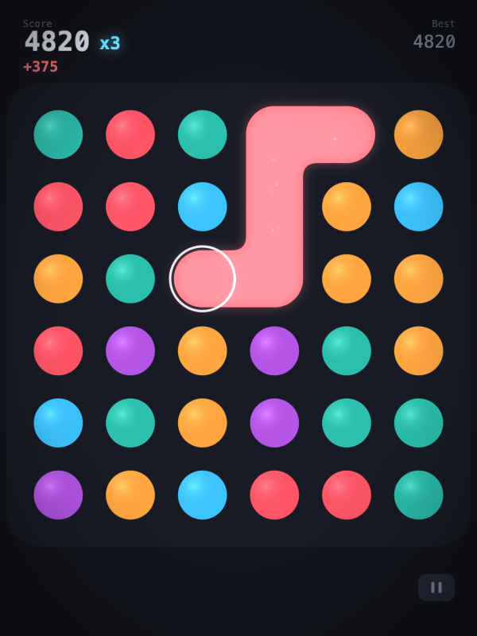
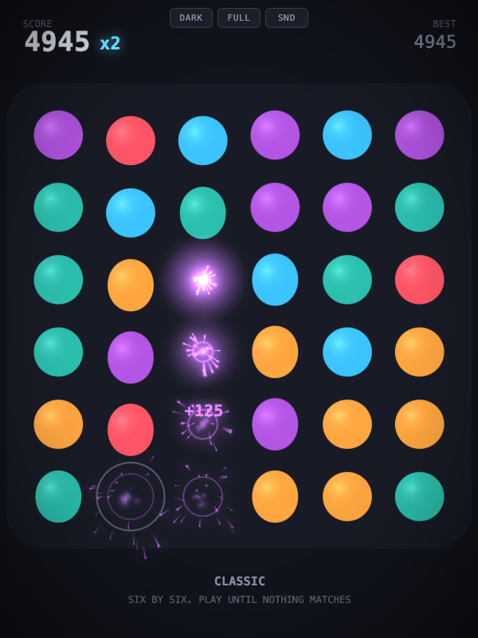
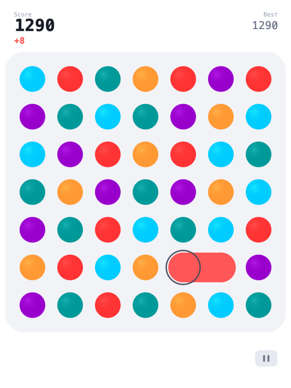
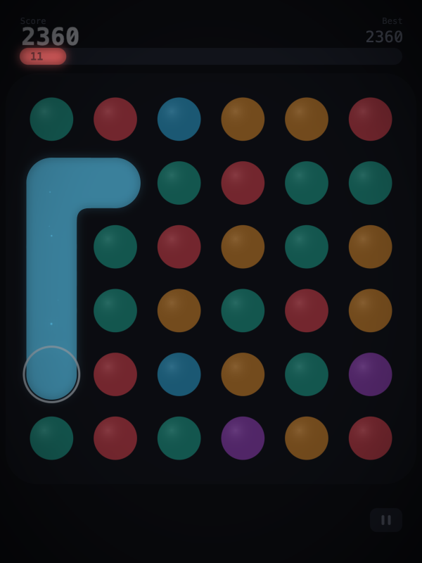
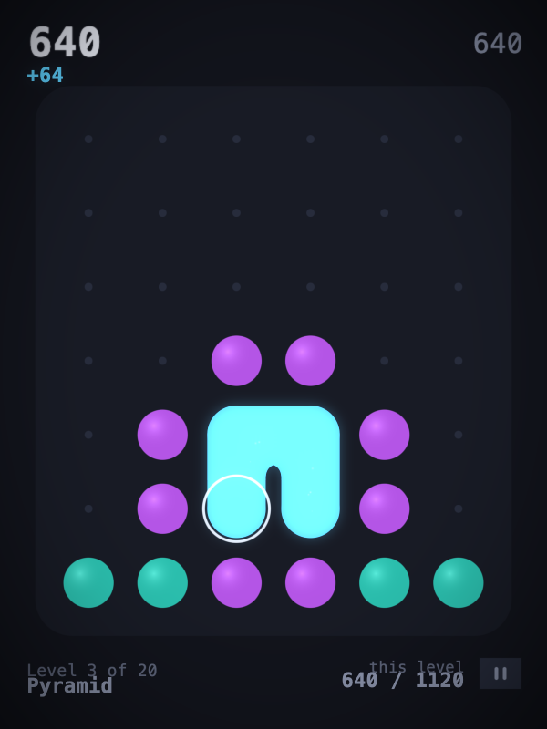
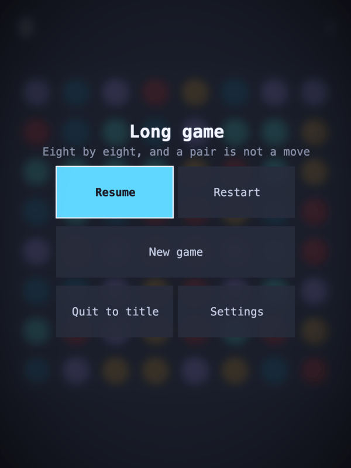
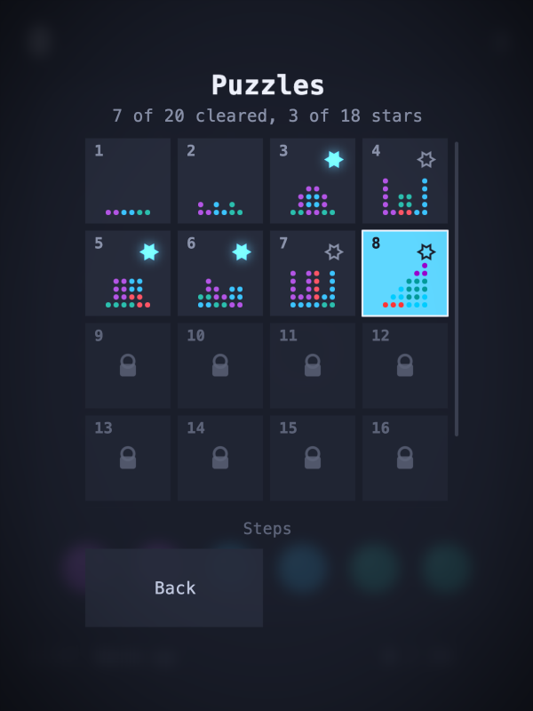
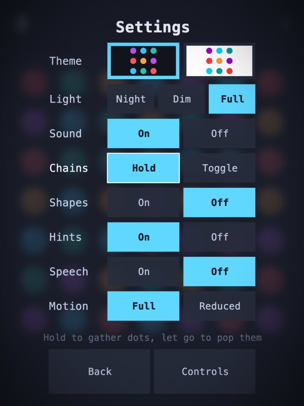

# Dots

Draw a line through dots of one colour to pop them out of existence.

**[Play it here](https://gadgetoid.github.io/dots/)** - it needs WebGL2 and nothing else.

Dots started life around 2013 as a RaphaelJS toy - SVG circles, a drag handler and
a 90 second clock. Very heavily inspired by the 2013 iPhone game of the same name, which in turn was basically a minimalist Bejeweled (Grandma would be proud <3). It got embedded into a couple of websites where people played and enjoyed it, but never amounted to more than that.

It was later rewritten in C++ for the [32blit](https://32blit.com)
handheld, which gained it a cursor, a score multiplier and a proper lose condition,
and lost it antialiasing. This is that game again in WebGL2: the same five colours
and the same cubed scoring, with the graphics the STM32 could never have managed.

Along for the ride come a slew of visual accessibility options, hopefully opening up the game for more players, and perhaps another thirteen years of life.

Two of the three still exist to compare against: the 32blit version is in
[32blit-dots](https://github.com/gadgetoid/32blit-dots) and the original in
[raphaeljs-dots](https://github.com/gadgetoid/raphaeljs-dots).

## Screenshots

|                                                        |                                                               |
| ------------------------------------------------------ | ------------------------------------------------------------- |
|  |                  |
|    |  |
|     |                        |
|            |                 |

## Playing

Link two or more dots of one colour through cardinal neighbours - never diagonals -
and pop them. A chain is worth the cube of its length, so six dots taken together
are worth far more than three pairs. Clear four or more and the next chain scores at
a multiplier.

| Device   | Controls                                                                           |
| -------- | ---------------------------------------------------------------------------------- |
| Keyboard | Arrows or WASD move, space links and pops, X drops the chain, escape for the menu  |
| Gamepad  | D-pad or left stick move, A links and pops, B drops the chain, select for the menu |
| Touch    | Drag across dots to link them, let go to pop. The pause button is under the board  |

The 32blit version held A down while moving and popped on release, so a slip of the
thumb threw a chain away. Here a press starts the chain and it stays: moving onto a
neighbour extends it, moving back retracts it, a second press pops it and the drop
button is the only other thing that can spend it. Every control is rebindable from the
controls page, per device.

Everything else is in the menu, which is the title screen, the pause screen and the
game-over screen alike: choose a mode and it starts, and the theme, brightness and
sound are rows of options that can be tapped, walked onto with left and right, or
pressed - the theme as two little boards to pick between rather than a word. Brightness
scales the whole frame in the composite pass, bloom included, for playing in the dark.

The page holds nothing but the canvas: no buttons and no help line. Every control the
player has is drawn inside the field, because a button in the page can only be pressed
by a pointer and this game is played as often with a pad or a keyboard.

Opening the game starts a game. A player who has been here before carries on with the mode
they last played, and a first-time player gets the seeded board of the day, which is the one
everybody else is on. The title screen is still there behind Quit to title; it is a page to
be left rather than a toll to be paid.

## Links

Any board can be linked to, all in the query string so a link survives being served from a
subpath and needs no rewrite rules:

| Link           | Opens                                                                      |
| -------------- | -------------------------------------------------------------------------- |
| `?seed`        | the seeded mode on today's board                                           |
| `?seed=314522` | the seeded mode on that code                                               |
| `?mode=rush`   | that mode, by id, as `src/modes/` names it                                 |
| `?puzzle=9`    | puzzle level 9 of the set being played, counted from one as the HUD counts |
| `?puzzle=comb` | that puzzle level by name, in whichever set holds it                       |

The game writes the link for whatever is being played back into the address bar, so copying
the URL is the whole of sharing a board. Today's seeded board writes a valueless `?seed`
rather than its code: pinning the code would mean a reload tomorrow dealt yesterday's board,
and a link passed on would mean the board of the day it was copied instead of the board of
the day.

A link is honoured or refused, never approximated - a link that quietly opened a different
board from the one it names would be worse than one that failed. A puzzle nobody has reached
yet opens the picker with a line saying which level was asked for, since dropping a player
into a level they have not climbed to would give away the ladder.

## Modes

| Mode        | Board | Chain | What is different                                       |
| ----------- | ----- | ----- | ------------------------------------------------------- |
| Classic     | 6x6   | 2     | The 32blit game. Refills until nothing matches          |
| Rush        | 6x6   | 2     | Ninety seconds, as the original browser game gave       |
| Long game   | 8x8   | 3     | A pair is not a move                                    |
| Endless     | 7x7   | 2     | Deals against itself: matches are hidden, never absent  |
| Elimination | 6x6   | 2     | A colour cleared off the board never comes back         |
| Clear out   | 6x7   | 2     | No refill, and the board is random. Whittle it down     |
| Puzzle      | 6x7   | 2     | Designed boards, in two sets, cleared one after another |
| Seeded      | 6x6   | 2     | The same board for everyone holding the code            |

The last three all come from the original browser game, which had `puzzle`,
`elimination` and an endless default. Elimination refills only with colours still in
play, so the pool shrinks as the game goes on and winning means taking the final colour
off the board. Puzzle is the authored one: nothing refills, so whether a level can be
emptied at all depends on the order the chains are taken in, because every pop collapses
the columns under it.

Clear out is the same premise on a random board, and a random board usually cannot be
emptied at all - at sizes small enough to search exhaustively, only about one dealt board
in ten can be, and the rest strand a colour whatever order they are taken in. So it asks
how far a board can be whittled down and reports what was left on it, and clearing one
outright is an occasional thing worth a mention. If you want a board that is certainly
clearable, that is what the designed levels are for.

Seeded is classic rules dealt from a number, which the 32blit version had: the board and
every colour dealt after it come from one seed, so two players holding the same code play
the same dots and the only thing between them is the score. A code is six dots, written as
six digits 1 to 5 the same way a level's layout is - 15,625 boards, entered by pressing the
dots round the colours or by typing the digits, and shared as a link. The board of the day is
counted in whole UTC days, so everyone quoting today's code means the same one, and the best
score is remembered per code.

The 32blit game's own generator is not reproduced. It was an LFSR with a 16 bit tap, which
gives a period of 32,767 and puts every seed on one ring at a different offset, so seed N+1
deals seed N's board shifted along by one dot: fine for a number nudged with a d-pad, and
not for a code people pass around. The seed feeds `mulberry32` instead, under which all
15,625 codes give distinct boards, none of them opening without a legal move.

A mode is a plain object - grid size, minimum chain length, how many colours, whether
it refills, an optional clock, an optional tuning, optional levels, whether it deals from
a seed - plus optional
hooks for choosing what it deals and judging what it left. Endless uses the hooks: it
picks colours that avoid their neighbours, so nothing is handed to you, and if that
leaves a dead board it recolours the shortest legal run back in, somewhere in the
middle where it is hardest to spot. Adding a mode is a file in `src/modes/` and a line
in `src/modes/index.js`.

### Levels

A level is drawn in `src/modes/levels.js`, in ASCII so it can be read and edited as the shape
it is:

```
"......"
"......"
"......"
"..11.."
".1221."
".1221."
"331133"
```

A digit is a colour and a dot is an empty cell, numbered as the original game's level data
numbered them. What is drawn falls, so a shape does not have to be bottom-aligned by hand,
though the shipped ones are written already fallen so the file shows what the board will look
like. `prettier-ignore` keeps the formatter from flattening each one onto a single line.

There are two sets of fifty-two, and the button at the foot of the picker swaps between them: two
ladders rather than one long one, each opening on a warm up and ending on the hardest board it holds.
No board is in both, and that is checked for mirrors and recolourings as well as for exact copies.
Each set remembers how far it got on its own, so a player stuck on one can go and play the other.

Within a set they open one at a time as the one before is cleared, and any that has been reached can
be resumed. Each level carries two exact numbers:

| Field   | What it is                                                                       |
| ------- | -------------------------------------------------------------------------------- |
| `par`   | the most the level can score, over every order that clears it. A star for it     |
| `floor` | the least any clearing order scores. Equal to par means how it is played is moot |

Both are exact because the question is finite: a pop only ever takes dots off the board, so
the positions reachable from a layout form a graph with no cycles and each need only be valued
once, with the multiplier as part of what is valued. The largest level is about nine million
positions, which is a few minutes of work - so both are written down beside the layout, and what
has been proved about a board goes in `data/verified-boards.json` by `tools/verify-levels.mjs`.
`test/levels.test.js` reads that and walks a couple of levels a day besides, so the whole ladder
is re-proved over time. A number that has drifted from its layout fails the test.

The same test proves every level can be emptied at all, which matters because nothing refills:
a badly drawn level is one a player can only lose in. It also checks the order of the ladder,
which is by measured difficulty and rises from 2.0 to 11.8 across the first thirty-eight. The last
fourteen are arranged rather than sorted: all of them above everything before them, but swinging
between hard and harder and finishing on the hardest board in the game at 14.3. The first three
levels fall to taking the longest chain every time; the next nine have several clearing orders
that pay very differently; from the thirteenth exactly one order pays par and the obvious play
misses it or strands the board.

Difficulty is the interesting measure. `src/analysis.js` walks the same graph and answers all
of it at once: clearable or not, par, floor, how many orders pay par, how long the shortest
clearing order is, how many openings lose the level, and what greed would do. One refinement
is worth knowing: a trap that leaves a colour with a single dot on the board announces itself,
since nothing refills and a player can see it as plainly as the solver can. Every trap in the
original seven levels is that kind, which is why they play as forgiving even though most of
their moves strand the board. A trap that leaves everything still looking matchable is what
makes a level hard, and those come out of the collapse several moves deep.

Which is why the forty-five newer levels were searched for. The silhouettes in
`tools/find-levels.mjs` are drawn by hand, since no search knows what looks good; the colours
are searched, since none of the above can be seen in a layout. Growing regions of colour rather
than scattering dots took the share that can be cleared at all from 8.5% to 98%, and the search
climbs from those rather than drawing more of them: a matched pair of eight minute runs kept 26
boards climbing and none drawing.

```
node tools/levels.mjs                    # the table for the shipped set
node tools/find-levels.mjs --out found   # look for more, until stopped
```

[docs/puzzle-analysis.md](docs/puzzle-analysis.md) is the whole of it: the rules that bound the
problem, how a board is scored, what is worth knowing about one and why each answer is exactly
computable, what that costs, and what the search does about the cost.

## Sound

Linking and popping walk up a scale, so the scale is most of the character of a mode:
the same board sounds patient in hirajoshi and impatient in blues. A mode names a root
and a scale from `src/scales.js`, or asks for `"random"` and gets a different voice
every session, which is what Endless does.

Slendro and pelog are given in cents rather than semitones because they are not
equal-tempered scales, and flattening them onto twelve tones is most of what makes a
sampled gamelan sound wrong. They are still approximations - every gamelan is tuned to
itself - but of the right thing. Puzzle plays in slendro.

The engine underneath is Geometry II's, revoiced: sines and triangles through a
low-pass, a soft-clip on the mix, and a few milliseconds of attack on every envelope,
because an envelope that starts at full level clicks and a click is the one thing a
mellow sound cannot have.

## How it is built

```
index.html          the page, which is the canvas and nothing else
src/main.js         entry point: wires the DOM, creates everything, runs the loop
src/config.js       every tuneable, the layout maths and the input mapping
src/palette.js      the two themes
src/board.js        the grid, the linking rules, collapse and refill
src/modes/          one file per mode, plus the puzzle levels
src/seed.js         the code a seeded board is dealt from, and how it is written
src/link.js         what a link asks for, and how a board writes itself into one
src/scales.js       the tunings a mode can play in
src/specials.js     powerup registry (the contract; nothing registered yet)
src/game.js         phases, scoring, menus, settings, per-player chain state
src/particles.js    sparks, dust, rings, flashes and score floaters
src/view.js         everything that is drawn, as renderer primitives
src/renderer.js     the rendering contract
src/glrenderer.js   the WebGL2 backend
src/shaders.js      the GLSL, kept apart from the code that compiles it
src/audio.js        synthesised sound
src/input.js        keyboard and pointer
src/gamepad.js      pads
src/persistence.js  best scores, level and seed records, settings and bindings, in IndexedDB
```

The view is a fixed 600x800 field letterboxed into whatever the canvas is, so every
coordinate in the game is in those units and nothing has to know the window size.

Shapes are distance fields cut out of quads and antialiased with `fwidth` in the
fragment shader, so an edge is a pixel wide at any canvas size and there is no
multisampled target to pay for. A dot's jelly is part of that field: one damped
oscillator per dot scales its radius by a two-lobed cosine, so linking, landing or a
neighbour popping sets it ringing and the dot squashes and recovers.

The chain is a field too - circles at the dots, rectangles between them, at exactly the
dot radius, so a straight run has a straight outline no wider than a dot. The join is
an exact union rather than a smooth one, because two shapes overlapping along their
whole length are always within any smoothing distance of each other and the whole run
would inflate; the smoothing is passed per link and is zero unless that link turns, so
the fillet lands on the inside of a corner and nowhere else.

Bloom comes from an explicit glow layer rather than a bright-pass over the scene.
Only what the view marks as glowing goes into it, which is what lets the light theme
have a glowing chain without its white background blooming, and it means the glow
building as a chain grows is exactly the length of the chain and nothing else.

## Development

```
npm install
npm run check      # lint, format check, tests
```

The tests run under node with no browser: the board is pure logic, a `Game` can be
advanced frame by frame, the input mappings are pure functions, and the sound engine
is driven against a stub audio device.

What a unit test cannot see is a shader that will not compile, so the screenshot tool
doubles as the smoke test - it poses the real game in a real browser, shoots it, and
fails on any console or page error:

```
npm install --no-save puppeteer-core
node tools/screenshot.mjs
```

Publishing is a GitHub Actions workflow on every push to main, gated on the same checks.
It moves the scripts into a directory named after the commit, which is what stops a
browser serving an old game from its cache: every import in `src` is relative, so moving
the directory takes the whole module graph with it and one line of `index.html` changes.
The page itself cannot be versioned, since its URL is the URL people have, and GitHub
Pages serves HTML with a ten minute cache - that is the longest a player can be behind.

Each of the five entry points is bundled and minified on the way, which is only worth saying
because of how much of it is comment: 44% of what `src` holds, and all of it was going to every
player. One cold load on a slow connection went from 1.6 seconds and 130kB to 0.6 and 41kB.
There are no source maps and there is no bundling to develop the game - `index.html` in the
repo loads `src/main.js`, the tests import the modules, and the deployed copy is the small one.

```
npm run build      # _site/, with relative URLs, for a look
```

`strategy-guide.html` is a guide to playing well, also outside the game and not linked from it:
what a chain pays, what the sounds tell you, the traps, a table of every level and an animated
solution to each one behind a spoiler. Its tables and boards are built from the game's own modules
and its solutions come from `data/verified-boards.json`, so a level that changes takes the guide
with it. A board the file does not cover is solved in a worker on the page instead.

`editor.html` is a level editor, outside the game and not linked from it, built out of the
game's own renderer, palette and analysis so a board drawn in it is drawn by the code that
will draw it when it is played. It says whether the board can be cleared, what par and floor
would be, roughly how hard it is, and hands over the layout ready to paste into
`src/modes/levels.js` - or refuses to, if the board cannot be emptied. The analysis runs in a
worker, since judging a full board takes a couple of seconds and on the page's own thread
that is a couple of seconds of a dead editor after every click.

## Still to come

Powerups keyed to a dot colour, which say what they do while the cursor is over them:
nudge a column sideways to line up a match that was one place out, pop every dot of a
colour, that sort of thing. `src/specials.js` holds the contract and the board already
has the operations they need; nothing is registered.

And more than one player, up to four, with specials that reach across the board at
each other. The chain, cursor, score and multiplier are already per player, a dot
records whose chain has claimed it, and every input method takes a player index, so
what is left is handing out the slots.

## On AI

Like [GEOMETRY II](https://github.com/gadgetoid/geometry) before it, this was built
with heavy assistance from, and detailed direction of, Claude Code. The 32blit game
and the RaphaelJS one before it are mine; this is them again, with the graphics I
wanted at the time and did not have the CPU or the patience for.
